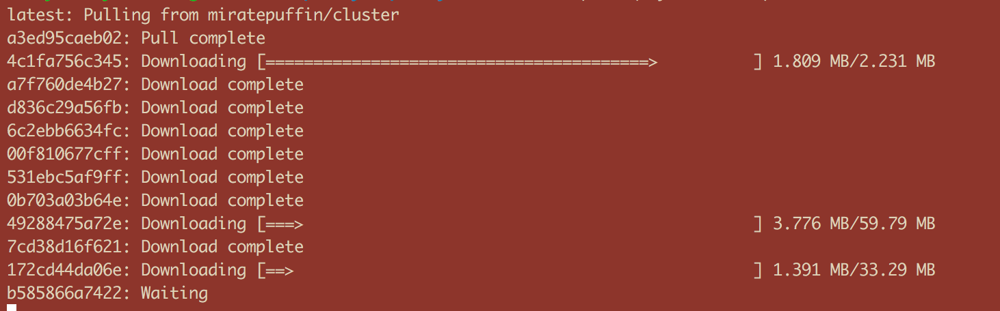
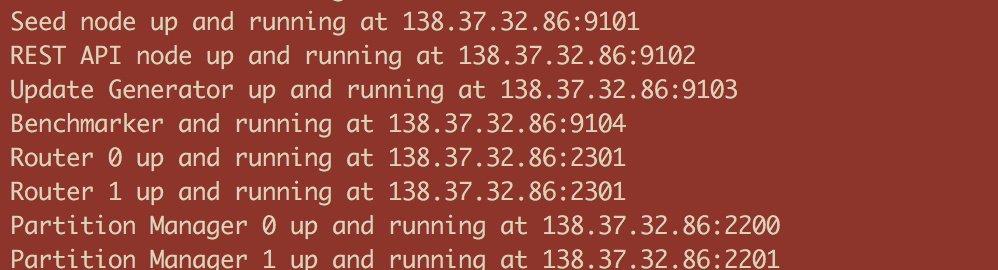
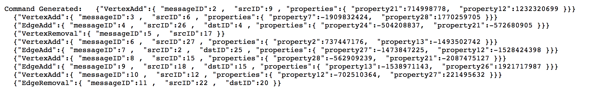
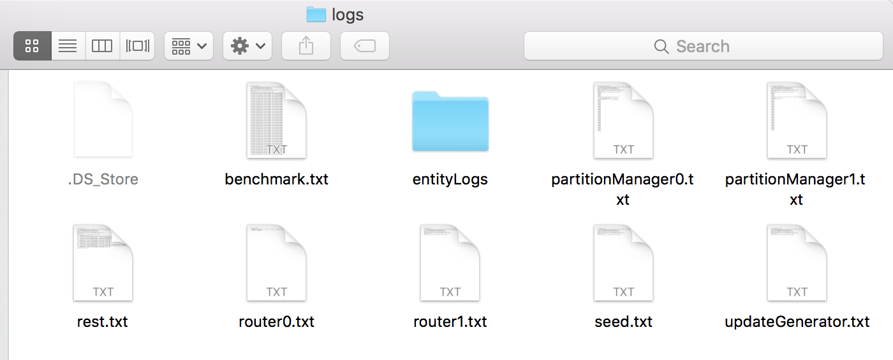
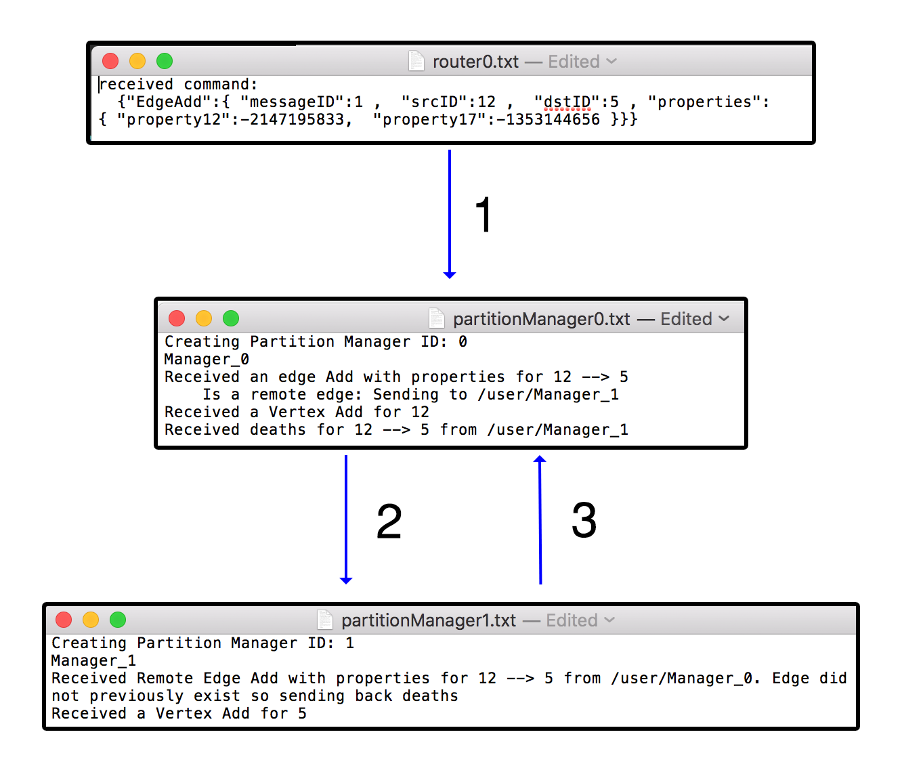
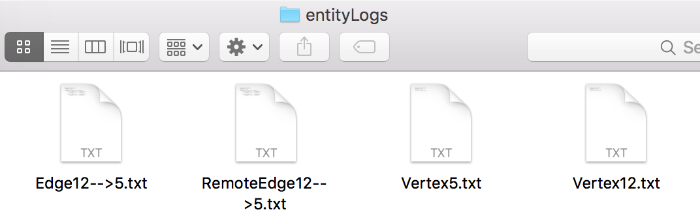
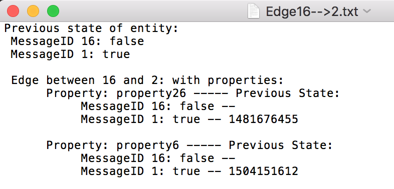

# Raphtory Introduction

Raphtory is an ongoing project to maintain and analyse a temporal graph within a distributed environment. The most recent paper on Raphtory can be found [here] (RaphtoryPaper.pdf).

Raphtory is built around the actor model using the [Akka Framework](http://akka.io/). There are two main Actor types, [Routers](cluster/src/main/scala/com.gwz.dockerexp/Actors/RaphtoryActors/RaphtoryRouter.scala) and [Partition Managers](cluster/src/main/scala/com.gwz.dockerexp/Actors/RaphtoryActors/PartitionManager.scala). Routers take in raw data from a given source and convert it to Graph updates, which may consist of adding, removing or updating the properties of a Vertex or Edge. The Partition Manager in charge of the Vertex (or source of an edge) will then be informed of the update, and will insert it into the ordered history of the affected entities. If the Partition manager is not in charge of all effected entities (such as an edge which spans between two Vertices which are stored in different partitions) it will communicate with other affected partitions to synchronize the update across the cluster. As Raphtory inserts updates into an ordered history, and no entities are actually deleted (just marked as deleted within their history) the order of execution does not matter. This means that Addition,Deletion and Updating are all addative and cummulative.An overview of this can be seen in the diagram below:

# Running Raphtory
To make Raphtory as easy to run as possible it has been containerised to be able to run within docker. This means that you only have to [install docker](https://docs.docker.com/engine/installation/) and you will be able to run raphtory on your machine. This was possible, thanks to the great example by [Nicolas A Perez](https://github.com/anicolaspp/docker-exp/tree/cluster) which allowed me to get Akka working within docker.

## Quick Start

### Generating setup file
---
Once Docker is installed and running you must first generate the Raphtory setup script by running [setupgen.py](setupgen.py). This requires python3 which if not present on your machine can be installed via: 

**sudo apt-get install python3**

The setup generator requires three parameters: The number of partition managers, the number of routers and whether Raphtory is running on a local or remote docker image. You may choose any number of routers/partition managers, though it is recommended that you run on the online image (unless you wish to compile yourself with [sbt publish-local](http://www.scala-sbt.org/sbt-native-packager/formats/docker.html) ).
 
Run: **python3 setupgen.py 2 2 ""**

This should create a new file called **autogen.sh**. 

---
### Downloading the Docker image
---
Next, before running the setup script, it is best to first download the docker image from quay.io. The script will do this automatically, but multiple times (one for each running container leading to A LOT of text exploding on your terminal).

Run: **docker pull quay.io/miratepuffin/cluster:latest**  

sudo may be required as docker accesses */var/run/docker.sock* (Error will look something like this "Cannot connect to the Docker daemon. Is the docker daemon running on this host?")

This will pull all components of the image, as can be seen in the image below:
 

---
### Running the setup script
---

Once the image has completed downloading, you can run the setup script to start your Raphtory cluster. Again sudo may be required. You may also need to change the permissions of the file to allow it to run:

Run: **chmod 777 autoSetup.sh**

Run: **./autoSetup.sh**  

**Warning: This will also kill all running containers.**

If you have run the same command as above, in the terminal you should see something along these lines:

 

This tells you all the containers that you have started up, specifying the IP and port they are running on. The important ones for this quick start are the two router containers, the two partition managers and the rest API. 

The setup script will also create a log folder within the running directory, storing the output from the containers (showing how messages are passed around) and the output from the graph entities (their full history). An example of this can be seen in the final section.

If you wish to stop the cluster, run the command: **./dockblock.sh**

---
### Utilising the Rest API
---

After giving the containers a couple of seconds to connect to each other you can now contact the rest api to create and delete vertices/edges within Raphtory.

The Rest API will be running on the given IP (138.37.32.86 in the example above, but will be different for you) at port 8080. 

For random command generation you can access:
 
* Add a Vertex - 138.37.32.86:8080/addvertex
* Add an Edge - 138.37.32.86:8080/addedge
* Remove a Vertex - 138.37.32.86:8080/rmvvertex
* Remove an Edge - 138.37.32.86:8080/rmvedge
* Generate 10 random messages - 138.37.32.86:8080/random

Your browser should return a list of commands similar to the following: 
 
Note: When Vertices or Edges are created, they also assigned some properties in Key value format. 

---
### Seeing what happened
---
Now that we have got the cluster up and running we can create some data and explore what happens. Below is the overview of the Log folder structure:

 
As an example I contacted the rest API via **/addedge** and it created a new edge between vertex 12 and 5. 

#### What happens within the system

* First the command is received by a random router (Router 0 in this instance). 
* This then routes the command to partition manager 0 who is in charge of the source vertex (arrow 1).
* Partition manager 0 creates the source vertex (12) and a local copy of the edge. As it is not in charge of vertex 5 it contacts the Manager who is; in this case PM 1 (arrow 2). 
* Partition Manager 1 creates the destination Vertex (5) and its own copy of the edge. It then informs manager 0 that the destination vertex is newly created and was not previously removed from the graph, as this would effect the edge and have to be syncronised. (arrow 3) 
* The edge and its ajoining vertices are now stored within the graph. 

These entities can then be found within the entityLogs folder. Below you can see Vertex 12 & 5 (source and destination) and the local/remote copies of the edge:

If I now contact the rst API via **/random** several times it will generate a variety of commands and build up the history within individual entities. For example, the below edge was created at time 1 (message 1) and deleted at time 16. This is reflected in its own history at the top, as well as within the internal history of its associated properties:

