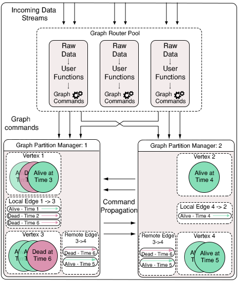

Currently writing up the readme, shall be done by this evening (20/6/17)

# Raphtory Introduction

Raphtory is an ongoing project to maintain and analyse a temporal graph within a distributed environment. The most recent paper on Raphtory can be found [here] (RaphtoryPaper.pdf).

Raphtory is built around the actor model using the [Akka Framework](http://akka.io/). There are two main Actor types, [Routers](cluster/src/main/scala/com.gwz.dockerexp/Actors/RaphtoryActors/RaphtoryRouter.scala) and [Partition Managers](cluster/src/main/scala/com.gwz.dockerexp/Actors/RaphtoryActors/PartitionManager.scala). Routers take in raw data from a given source and convert it to Graph updates, which may consist of adding, removing or updating the properties of a Vertex or Edge. The Partition Manager in charge of the Vertex (or source of an edge) will then be informed of the update, and will insert it into the ordered history of the affected entities. If the Partition manager is not in charge of all effected entities (such as an edge which spans between two Vertices which are stored in different partitions) it will communicate with other affected partitions to synchronize the update across the cluster. As Raphtory inserts updates into an ordered history, and no entities are actually deleted (just marked as deleted within their history) the order of execution does not matter. This means that Addition,Deletion and Updating are all addative and cummulative.An overview of this can be seen in the diagram below:

#Running Raphtory
To make Raphtory as easy to run as possible it has been containerised to be able to run within docker. This means that you only have to [install docker](https://docs.docker.com/engine/installation/) and you will be able to run raphtory on your machine. This was possible, thanks to the great example by [Nicolas A Perez](https://github.com/anicolaspp/docker-exp/tree/cluster) which allowed me to get Akka working within docker.

##Quick Start
If you wish to get Raphtory running as soon as possible, once Docker is installed you can simply run the [setup.sh](setup.sh) bash file. This will run two router containers, two partition managers and the rest API. It will then create a log folder within the running directory, which will store the output from the actors (showing how messages are passed around) and the output from the entities (their full history). Note: There will be several other containers running (a seed node, and command generator, but these do not matter here).

  **Warning: This will also kill all running containers.**

