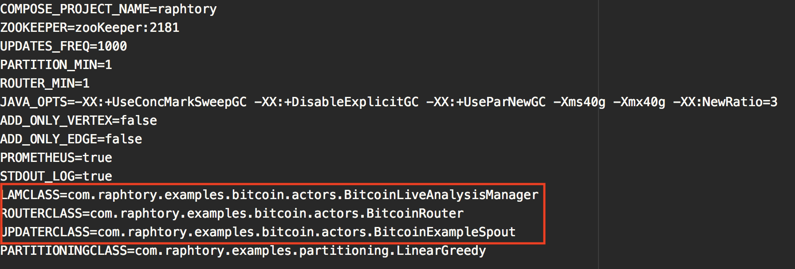
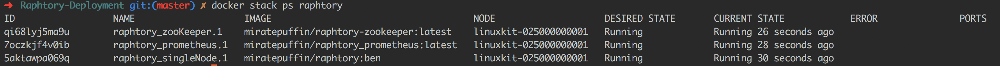
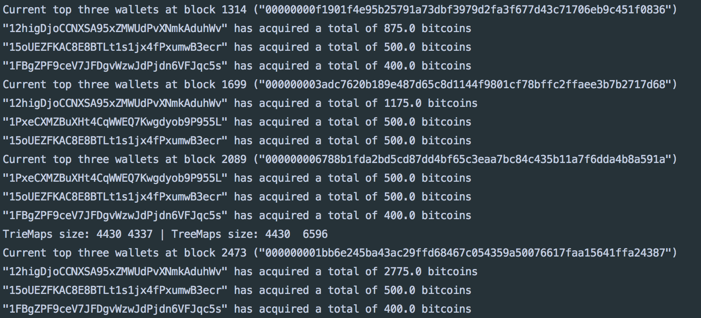
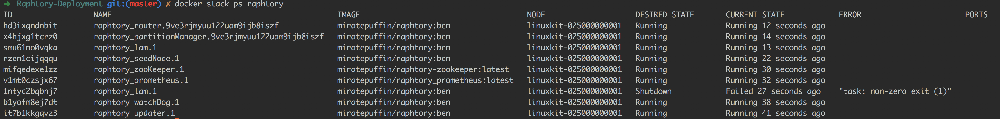
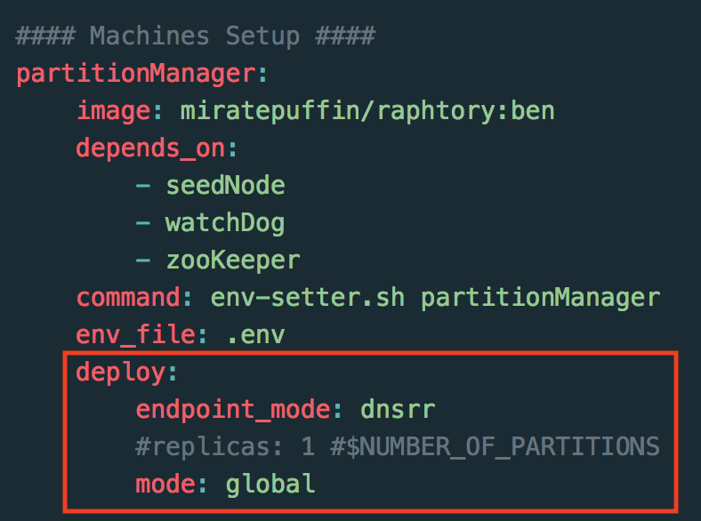

# Raphtory Introduction
Raphtory is an ongoing project to maintain and analyse a temporal graph within a distributed environment. The most recent paper on Raphtory can be found [here](RaphtoryPaper.pdf).

Raphtory is built around the actor model using the [Akka Framework](http://akka.io/). There are two main Actor types, [Routers](cluster/src/main/scala/com.gwz.dockerexp/Actors/RaphtoryActors/RaphtoryRouter.scala) and [Partition Managers](cluster/src/main/scala/com.gwz.dockerexp/Actors/RaphtoryActors/PartitionManager.scala).

Routers take in raw data from a given source and convert it to Graph updates, which may consist of adding, removing or updating the properties of a Vertex or Edge. The Partition Manager in charge of the Vertex (or source of an edge) will then be informed of the update, and will insert it into the ordered history of the affected entities. If the Partition manager is not in charge of all effected entities (such as an edge which spans between two Vertices which are stored in different partitions) it will communicate with other affected partitions to synchronize the update across the cluster.

As Raphtory inserts updates into an ordered history, and no entities are actually deleted (just marked as deleted within their history) the order of execution does not matter. This means that Addition,Deletion and Updating are all addative and cummulative. An overview of this can be seen in the diagram below:

<p align="center">
  
</p>

# Running Raphtory
To make Raphtory as easy to run as possible it has been containerised within docker. This means that you only have to [install docker](https://docs.docker.com/engine/installation/) and you will be able to run raphtory on your machine. 

First clone the [Raphtory-Deployment](https://github.com/miratepuffin/Raphtory-Deployment) project which contains all of the yml files required for running. Once this is cloned and you have docker installed, run: 

```bash
docker swarm init  
``` 

This will initialise a docker swarm cluster onto your machine which will allow you to deploy via [docker stack](https://docs.docker.com/engine/reference/commandline/stack/). Docker stack requires a [Docker Compose](https://docs.docker.com/compose/compose-file/) file to specify what containers to run, how many of each type and what ports to open etc. Within the [Raphtory-Deployment](https://github.com/miratepuffin/Raphtory-Deployment) repository there are two main compose files: One for running on a [cluster](https://github.com/miratepuffin/Raphtory-Deployment/blob/master/docker-compose.yml), one for running [locally](https://github.com/miratepuffin/Raphtory-Deployment/blob/master/docker-compose-local.yml).

##Example workloads to pick from
Once Docker is setup you must pick an example workload to test. There are three to choose from (available [here](https://github.com/miratepuffin/raphtory/tree/master/mainproject/cluster/src/main/scala/com/raphtory/examples)): A 'random' graph where updates are generated at runtime; the [GAB.AI](https://gab.ai/) graph (a graph build from the posts on the social network); and a 'coingraph' built by ingesting the transactions within the bitcoin blockchain. 

Each datasource comes with a [Spout](https://github.com/miratepuffin/raphtory/blob/master/mainproject/cluster/src/main/scala/com/raphtory/core/actors/datasource/UpdaterTrait.scala) which generates/pulls the raw data, a [Router](https://github.com/miratepuffin/raphtory/blob/master/mainproject/cluster/src/main/scala/com/raphtory/core/actors/router/RouterTrait.scala) which parses the data into updates, and example [Live Analysis Managers](https://github.com/miratepuffin/raphtory/blob/master/mainproject/cluster/src/main/scala/com/raphtory/core/actors/analysismanager/LiveAnalysisManager.scala) which perform some basic processing. Note: Both GAB and Bitcoin workloads have example data baked into Raphtory's base image, meaning you can run these without having access to the GAB posts, or a Bitcoin full node established. 

Raphtory uses [Reflection](https://docs.scala-lang.org/overviews/reflection/overview.html) to decide what Spout/Router/Analysis Manager to create at run time. Therefore, to choose one of these examples you do not need to rebuild the Raphtory image, only change the docker [environment file](https://docs.docker.com/compose/env-file/) (.env) which docker stack requires when running. Example .env files are available [here](https://github.com/miratepuffin/Raphtory-Deployment/tree/master/EnvExamples) for each of the workloads. For the insturctions below I shall be using the 'fake' bitcoin environment [file](https://github.com/miratepuffin/Raphtory-Deployment/blob/master/EnvExamples/bitcoin_read_dotenv.example). This has several config variables which aren't too important for testing, the main one to focus on are the specified classes highlighted below:

<p align="center">
  
</p>
 

## Deploy locally via docker-compose/swarm
The first thing to do is to copy the example environment file to .env and deploy the docker stack: 

```bash
cp EnvExamples/bitcoin_read_dotenv.example .env
docker stack deploy --compose-file docker-compose-local.yml raphtory
```

If we look inside of the compose file, we will see three 'services' which this should deploy. Prometheus, which is the monitoring tool used for Raphtory. [Zookeeper](https://zookeeper.apache.org/) which containers can use to join the Akka network, and singleNode which contains all of the Raphtory components. We can check if the cluster is running via:

```bash
docker stack ps raphtory
```
which will list all of the containers running within the stack and allow you to connect to their output stream to see what is going on inside. This should look like the following: 

<p align="center">
  
</p>

We can then view the output from Raphtory running within in the single node via:

```bash
docker service logs raphtory_singleNode --follow
```  
There should then be some initial debug logs followed by the output for the analysis for the chosen workload. For example below we can see the Bitcoin Analyser returning the top three wallets which have aquired the most bitcoins at the latest ingested block. 

<p align="center">
  
</p>

In addition to these logs [Prometheus](https://prometheus.io/docs/practices/instrumentation/) is running at [http://localhost:8888](http://localhost:8888), providing additional metrics such as CPU/memory utilisation, number of vetices/edges and updates injested. 


Finally when you are happy everything is working, the cluster can be removed by running:

```bash
docker stack remove raphtory
```

## Deploy as a cluster
Deploying over a cluster is very similar to deploying locally, we again copy the env file and deploy via docker stack, but this time we use the docker-compose.yml file:

```bash
cp EnvExamples/bitcoin_read_dotenv.example .env
docker stack deploy --compose-file docker-compose.yml raphtory
```
When we look inside of this file it can be seen that there a lot more services. This is because each of the Raphtory cluster components are now within their own containers. It should be noted here that due to the random order docker starts up these containers, they can sometimes fail to connect to zookeeper and crash (see the Live analysis manager below). This is completely fine and the container will simply be restarted and connect to the cluster. 

<p align="center">
  
</p>

### Increasing the number of Routers and Partition Managers 
As you are now running in cluster mode the number of PM's and Routers within your cluster can be specified. This is set within the yml file under the 'deploy' section of each service. A nice way we have found to do this is to set the mode to global and then set a [label constraint](https://docs.docker.com/v17.09/datacenter/ucp/2.2/guides/admin/configure/add-labels-to-cluster-nodes/#apply-labels-to-a-node) for the service. This way you get one Partition on each chosen node within the swarm cluster.             

<p align="center">
  
</p>

In addition to the above, whilst Routers and Live Analysis Managers can leave and join the cluster at any time (as they are somewhat stateless), there has to be a set number of Partition Managers established at the start. This is set within the .env file under PARTITION_MIN and should match the number which will be created when the containers are deployed.