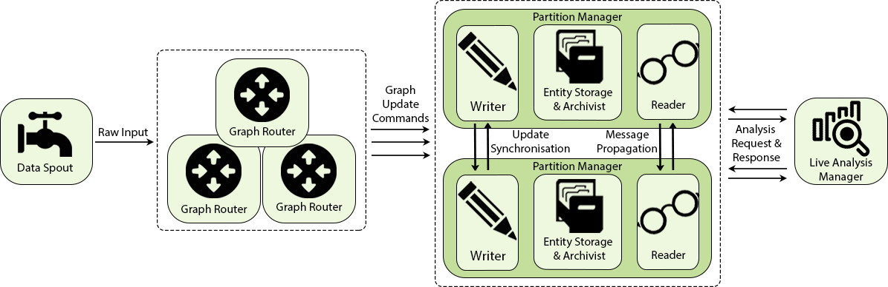

# Raphtory Introduction
Raphtory is an ongoing project to maintain and analyse a temporal graph within a distributed environment. The most recent article on Raphtory can be found [here](https://www.sciencedirect.com/science/article/pii/S0167739X19301621). Alternatively if you cannot access this science direct version a draft PDF can be found [here](Future_Generations_Computer_System_draft.pdf).

Raphtory is built around the actor model using the [Akka Framework](http://akka.io/). There are two main Actor types, [Routers](cluster/src/main/scala/com.gwz.dockerexp/Actors/RaphtoryActors/RaphtoryRouter.scala) and [Partition Managers](cluster/src/main/scala/com.gwz.dockerexp/Actors/RaphtoryActors/PartitionManager.scala).

Routers take in raw data from a given source and convert it to Graph updates, which may consist of adding, removing or updating the properties of a Vertex or Edge. The Partition Manager in charge of the Vertex (or source of an edge) will then be informed of the update, and will insert it into the ordered history of the affected entities. If the Partition manager is not in charge of all effected entities (such as an edge which spans between two Vertices which are stored in different partitions) it will communicate with other affected partitions to synchronize the update across the cluster.

As Raphtory inserts updates into an ordered history, and no entities are actually deleted (just marked as deleted within their history) the order of execution does not matter. This means that Addition,Deletion and Updating are all addative and cummulative. An overview of this can be seen in the diagram below:

  

## To run Raphtory please refer to the [Raphtory-Deployment](https://github.com/miratepuffin/Raphtory-Deployment) repository.

