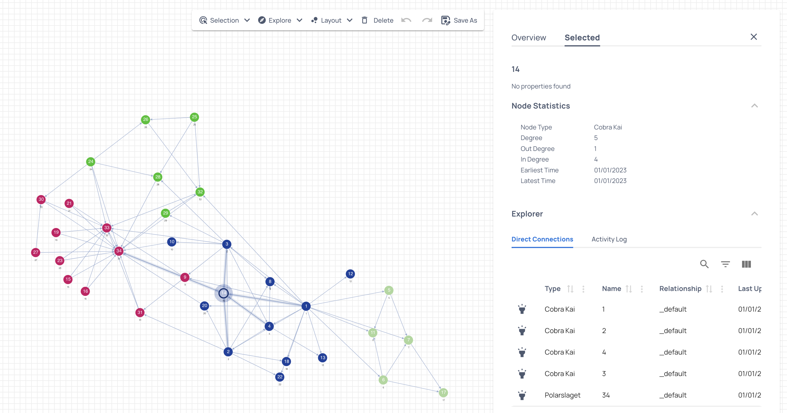

# Community detection

One important feature of graphs is the degree of clustering and presence of community structures. Groups of nodes that are densely connected amongst members of the group but have comparatively few connections with the rest of the graph can be considered distinct communities.

Identifying clusters can be informative in social, biological and technological networks. For example, identifying clusters in web clients accessing a site can help optimise performance using a CDN or spotting changes in the communities amongst a baboon pack over time might inform theories about group dynamics. Raphtory provides a variety of algorithms to analyse community structures in your graphs.

## Exploring Zachary's karate club network

As an example, we use a data set from the paper "An Information Flow Model for Conflict and Fission in Small Groups" by Wayne W. Zachary which captures social links between the 34 members of the club.

### Ingest data

First set up imports and ingest the data using NetworkX and Pandas to handle the `karate.gml` file.

/// tab | :fontawesome-brands-python: Python
```python
from raphtory import Graph
from raphtory import graphql
from raphtory import algorithms
import pandas as pd
import networkx as nx
import matplotlib.pyplot as plt

# Load the CSV file using NetworkX
edges_df = pd.read_csv("../data/karate.csv")
edges_df["time"] = pd.to_datetime(edges_df["time"])

print(edges_df.head())
```
///

You should see the dummy timestamps have been added in the head output.

!!! Output

    ```output
       source  target       time
    0       1       2 2023-01-01
    1       1       3 2023-01-01
    2       1       4 2023-01-01
    3       1       5 2023-01-01
    4       1       6 2023-01-01
    ```

### Create the graph

The dataframe can then be used to create a Raphtory graph:

/// tab | :fontawesome-brands-python: Python
```{.python continuation}
G = Graph()

G.load_edges(
    data=edges_df,
    src="source",
    dst="target",
    time="time",
)
```
///

### Analyse the clustering of club members

Raphtory provides multiple algorithms to perform community detection, including the following:

- [Louvain][raphtory.algorithms.louvain] - a commonly used and well understood modularity based algorithm.
- [Label propagation][raphtory.algorithms.label_propagation] - a more efficient cluster detection algorithm when used at scale.

Here we use the [Louvain][raphtory.algorithms.louvain] algorithm to identify distinct clusters of nodes.

/// tab | :fontawesome-brands-python: Python
```{.python continuation}
clustering = algorithms.louvain(G)

# Extract unique cluster values
unique_clusters = {cluster for node, cluster["community_id"] in clustering.items()}
print("Number of unique clusters:", len(unique_clusters))
```
///

!!! Output

    ```output
    Number of unique clusters: 4
    ```

```{.python continuation hide}
assert len(unique_clusters) == 4
```

The algorithm identifies four clusters of nodes which could be interpreted as four social groups amongst the students.

### Explore the data

You can explore the results of our cluster detection algorithm in greater detail using the Raphtory UI.

To do this assign a type to nodes of each cluster and start the Raphtory server. Each unique node type will be assigned a colour in the **Graph canvas** so that you can distinguish them visually.

/// tab | :fontawesome-brands-python: Python
```{.python continuation}

# Check value of cluster for each node and add to corresponding cluster list
labels = {0:'Cobra Kai',1:'Miyagi-Do',2:'Polarslaget',3:'Redentores'}
for node, cluster in clustering.items():
    G.node(node).set_node_type(labels[cluster])

# Start a Raphtory server and send the karate graph
server = graphql.GraphServer(".idea/my-test/graphs")
client = server.start().get_client()
client.send_graph("cluster-graph", G, overwrite=True)

```
///

```{.python continuation hide}
assert len(G.get_all_node_types()) == 4
```

You should see that there are four distinct communities, for each node you can see it's node type in the **Node Statistics** panel of the **Selected** menu and by visual inspection verify that each node is connected mostly to it's own group. 

You may also spot other features that could be investigated further, for example the nodes with the highest degree are members of the 'Miyagi-Do' cluster.

