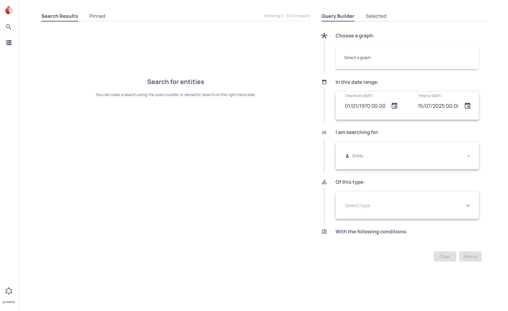
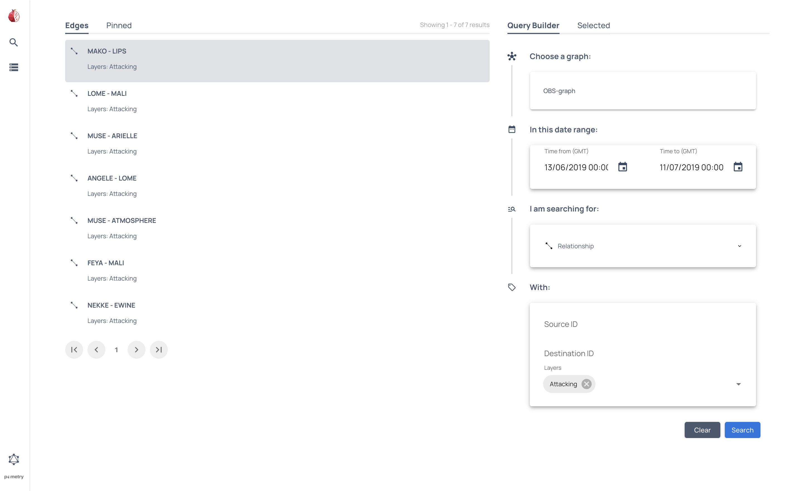

# Get started

Raphtory is a temporal graph database and analytics tool that you can use to investigate social graphs, detect fraud in financial transactions, power graphRAG AI systems, and much more.

Our powerful visual interface allows analysts to explore data and trace the evolution of relationships across time.  Data scientists can use APIs to create repeatable analytics pipelines using our built in filters and metrics or add their own custom algorithms.

Raphtory is written in Rust for speed and safety. However, you can interact with your graphs using:

- [Python][raphtory] - Our Python APIs are the primary way to create workflows and are described in detail in this documentation.
- [GraphQL](../graphql/1_intro.md) - Start a GraphQL server that you can interact with programmatically or using the playground integrated in the Raphtory UI.
- [Rust](https://docs.rs/raphtory/latest/raphtory/) - Interact directly with the Rust library to add new algorithms or build into fully featured products. 

## Ingest a simple dataset

You can build graphs directly in Raphtory or import data in standard formats. In the following example we use the `OBS.txt` baboon interaction dataset from [SocioPatterns](http://www.sociopatterns.org/datasets/baboons-interactions/) which is provided in a tab separated text file. 

To ingest this data you must first format it using `pandas` to create a dataframe and convert the timestamps to the `datetime` format. Then you can create a new graph `g` in Raphtory using the [`.load_edges_from_pandas()`][raphtory.Graph.load_edges_from_pandas] method and assigning each of the parameters appropriately. 

/// tab | :fontawesome-brands-python: Python
```python
from raphtory import Graph
from raphtory import graphql
from raphtory import algorithms as alg
import raphtory as rp
import pandas as pd

edges_df = pd.read_csv(
    "../data/OBS_data.txt", sep="\t", header=0, usecols=[0, 1, 2, 3, 4], parse_dates=[0]
)
edges_df["DateTime"] = pd.to_datetime(edges_df["DateTime"])
edges_df.dropna(axis=0, inplace=True)
edges_df["Weight"] = edges_df["Category"].apply(
    lambda c: 1 if (c == "Affiliative") else (-1 if (c == "Agonistic") else 0)
)

g = rp.Graph()
g.load_edges_from_pandas(
    df=edges_df,
    src="Actor",
    dst="Recipient",
    time="DateTime",
    layer_col="Behavior",
    properties=["Weight"],
)
print(g)

```
///

```{.python continuation hide}
assert str(g) == "Graph(number_of_nodes=22, number_of_edges=290, number_of_temporal_edges=3196, earliest_time=1560419400000, latest_time=1562756700000)"
```

You can print the state of the graph object to verify it exists.

!!! Output

    ```output
    Graph(number_of_nodes=22, number_of_edges=290, number_of_temporal_edges=3196, earliest_time=1560419400000, latest_time=1562756700000)
    ```


For more details, see [Creating a graph](../ingestion/1_intro.md).

## Query your data

Once you have created a graph you can start to analyse it and isolate interesting features. 

Continuing from the previous example, you can use the PageRank algorithm to find important nodes.

/// tab | :fontawesome-brands-python: Python
```{.python continuation}
results = alg.pagerank(g)
top_5 = results.top_k(5)
for rank, (node, score) in enumerate(top_5.items(),1):
    print(f"Rank {rank}: {node.name} with a score of {score:.5f}")
```
///

```{.python continuation hide}
assert str(f"PETOULETTE's ranking is {round(results.get('PETOULETTE'), 5)}") == "PETOULETTE's ranking is 0.0599"
```

!!! Output

    ```output
    Rank 1: PETOULETTE with a score of 0.05990
    Rank 2: BOBO with a score of 0.05941
    Rank 3: LIPS with a score of 0.05812
    Rank 4: FELIPE with a score of 0.05788
    Rank 5: VIOLETTE with a score of 0.05759
    ```

Once you have identified some interesting features, you can performed more detailed analysis by filtering your results or examining them across a [window of history](../views/2_time.md). 

## Start the UI server

To start the Raphtory UI you need to:

1. Create a [GraphServer][raphtory.graphql.GraphServer] and client.
    - Every `GraphServer` needs a working directory, you can name this anything.
2. Start the server and get a [RaphtoryClient][raphtory.graphql.RaphtoryClient].
3. Send the relevant graphs to this client (in this case you only have one graph available).

/// tab | :fontawesome-brands-python: Python
```{.python continuation}
server = graphql.GraphServer(".idea/my-test/graphs")
client = server.start().get_client()
client.send_graph("OBS-graph", g, overwrite=True)
```
///

This will start the UI locally on the default port `1736`, you should see **Search** page by default.



You can use the **Query Builder** to select the graph you created and identify which baboons attacked each other in the last month.



For more information see the full [User Interface overview](2_UI_overview.md)
