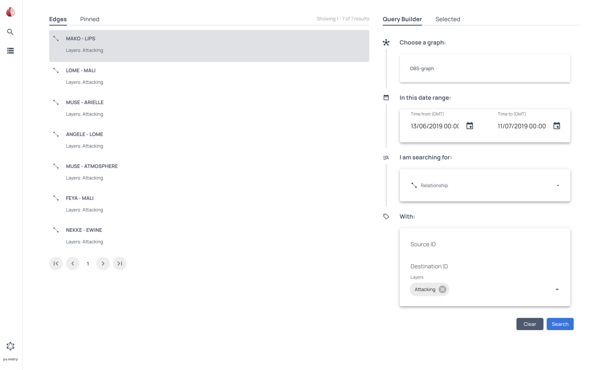
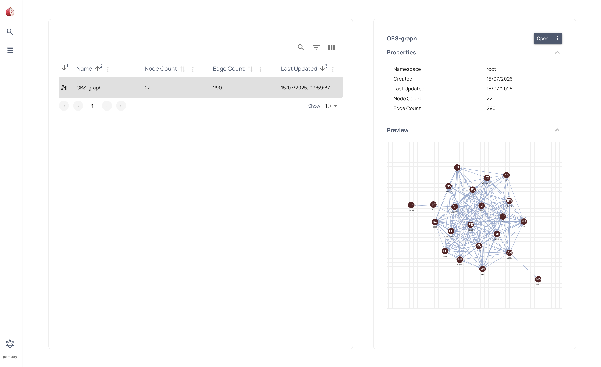
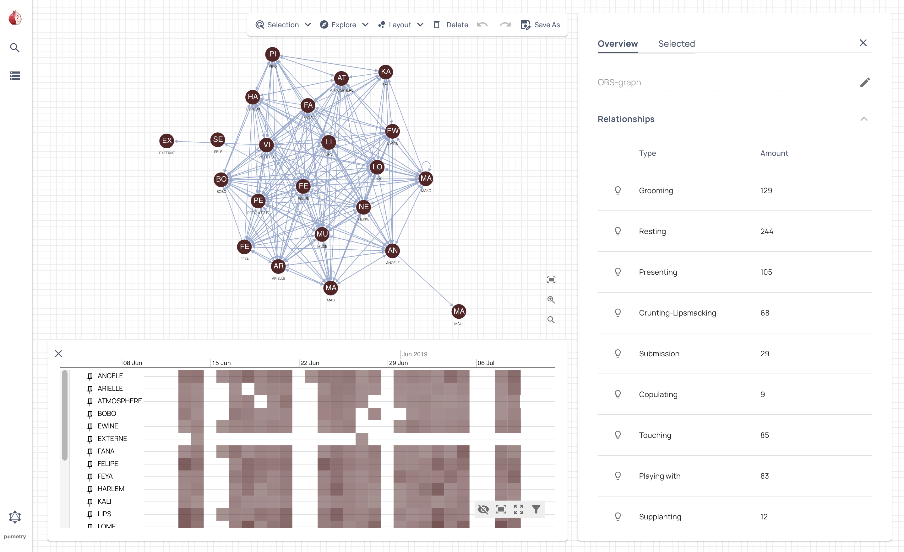
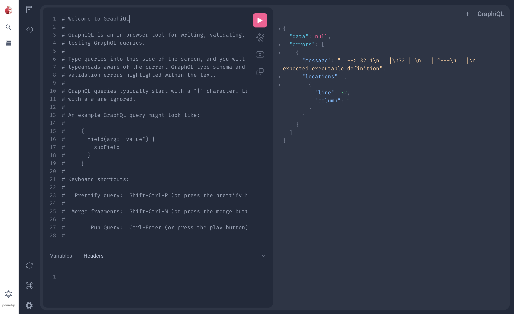

# User Interface overview

## Search page

The **Search page** consists of the following elements:

- **Global menu** - Switch between any of the main pages.
- **Search results** - Shows the results of your query.
- **Pinned results** - Shows any results you have pinned.
- **Query Builder** - Search  a selected graph using the options provided.
- **Selected** - Shows contextual information about the current selection.

## Graphs page

The **Graphs page** consists of the following elements:

- **Global menu** - Switch between any of the main pages.
- **Graphs list** - Shows the available graphs.
- **Context menu** - Shows contextual information about the current selection.

## Graph view

The **Graph view** displays the graph or sub-graph you have selected and provides information on that selection. You can also refine your selection further or save it as a new graph.

The **Graph view** consists of the following elements: 

- **Global menu** - Switch between any of the main pages.
- **Toolbar** - Manipulate the current selection.
- **Context menu** - Shows contextual information about the current selection.
    - **Overview** - Information the currently selected graph or sub-graph.
    - **Selected** - Information about the selected node or edge.
- **Graph canvas** - Displays the current graph or sub-graph. You can select a node or edge to show it's information in the **Context menu**.
- **Temporal view** - Displays the edges of the current graph or sub-graph as a timeline of events. On longer timescales edges are shown as a heatmap instead of discrete events.

## GraphQL playground

This page allows you to access the standard [GraphiQL](https://github.com/graphql/graphiql) playground.
