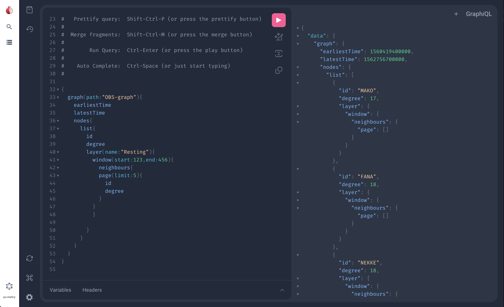

# User Interface overview

## Search page

The **Search page** consists of the following elements:

- **Global menu** - Switch between any of the main pages.
- **Search results** - Shows the results of your query.
- **Pinned results** - Shows any results you have pinned.
- **Query Builder** - Search  a selected graph using the options provided.
- **Selected** - Shows contextual information about the current selection.

## Graphs page

The **Graphs page** consists of the following elements:

- **Global menu** - Switch between any of the main pages.
- **Graphs list** - Shows the available graphs.
- **Context menu** - Shows contextual information about the current selection.

## Graph view

The **Graph view** displays the graph or sub-graph you have selected and provides information on that selection. You can also refine your selection further or save it as a new graph.

The **Graph view** consists of the following elements:

- **Global menu** - Switch between any of the main pages.
- **Toolbar** - Manipulate the current selection.
- **Context menu** - Shows contextual information about the current selection.
    - **Overview** - Information the currently selected graph or sub-graph.
    - **Layout** - Modify how the layout engine displays the graph.
    - **Selected** - Information about the selected node or edge.
- **Graph canvas** - Displays the current graph or sub-graph. You can select a node or edge to show it's information in the **Context menu**.
- **Temporal view** - Displays the edges of the current graph or sub-graph as a timeline of events. On longer timescales edges are shown as a heatmap instead of discrete events.

### Modifying the Layout

The Raphtory UI gives you detailed control over how your graphs are displayed. You can use this to match your preferences, build custom visualisations for reports or better fit the shape of your data.

Raphtory's layout engine is built on [G6](https://github.com/antvis/G6) and many of the [D3 Force-Directed Layout](https://g6.antv.antgroup.com/en/manual/layout/d3-force-layout) parameters are exposed in the **Layout** tab of the **Context menu**.

You can select from the following layout algorithms:

- Default
- Concentric
- Force Based
- Hierarchical TD
- Hierarchical LR

For each layout, specific **Advanced Options** can be set to tune the algorithm.

#### Default Layout

| Parameter             | Description                                                                                                                                                     |
|-----------------------|-----------------------------------------------------------------------------------------------------------------------------------------------------------------|
| Collision Radius      | The collision force treats nodes as circles with a given radius, rather than points, and prevents nodes from overlapping. You can specify the effective radius. |
| Collision Strength    | Sets the strength of the collision force.                                                                                                                       |
| Link Distance         | Specify an ideal edge length.                                                                                                                                   |
| Link Strength         | Higher link strength results in distances closer to the ideal.                                                                                                  |
| Many-Body Force       | The mutual force between nodes, a positive value is attractive and a negative value is repulsive.                                                               |
| Many-Body Range       | Set a maximum and minimum distance between nodes that where many-body forces are applied.                                                                       |
| Center Force          | Applies a uniform force on all nodes towards the center.                                                                                                        |
| Radial Force Strength | Applies a uniform force on all nodes within a specified radius towards the center.                                                                              |
| Radial Force Radius   | Specify a radius for the radial force.                                                                                                                          |

#### Concentric Layout

| Parameter                  | Description                                                              |
|----------------------------|--------------------------------------------------------------------------|
| Use Clockwise              | Enable to add nodes in a clockwise order.                                |
| Maintain Equidistant Rings | Enable to require equidistant rings.                                     |
| Node Size                  | Effective node diameter. This effects ring spacing to avoid collision.   |
| Node Spacing               | Minimum spacing between rings.                                           |
| Prevent Overlap            | Enable to prevent overlap between nodes. Only works if Node Size is set. |
| Start Angle                | Start angle where the first node is added. Specified in radians.         |
| Sweep                      | Angle between the first and last nodes in the same ring.                 |

#### Force Based Layout

| Parameter | Description                                                                                     |
|-----------|-------------------------------------------------------------------------------------------------|
| Gravity   | Applies a force on all nodes towards the center proportional to their distance from the center. |
| Speed     | Movement speed per iteration of the algorithm.                                                  |

#### Hierarchical TB Layout

| Parameter                  | Description                                          |
|----------------------------|------------------------------------------------------|
| Invert                     | Enable to invert the direction.                      |
| Direction                  | Specify how the node hierarchy should be aligned.    |
| Node Separation            | Separation of nodes in the same rank.                |
| Rank Separation            | Separation between ranks.                            |
| Rank algorithm             | Specify the algorithm used to assign nodes to ranks. |
| Node Size                  | Node size used for collision.                        |
| Retain Edge Control Points | Enable to use control points.                        |

#### Pre-layout algorithms

Optionally, you can set a pre-layout algorithm that runs before the primary layout algorithm:

- Concentric - arranged around the center.
- Dagre LR - arranged using the hierarchical Dagre algorithm from left to right.
- Dagre TB - arranged using the hierarchical Dagre algorithm from top to bottom.

For Concentric and Dagre TB algorithms you can also specify **Advanced Options** when used in the pre-layout phase.

## GraphQL playground

This page allows you to access the standard [GraphiQL](https://github.com/graphql/graphiql) playground.
