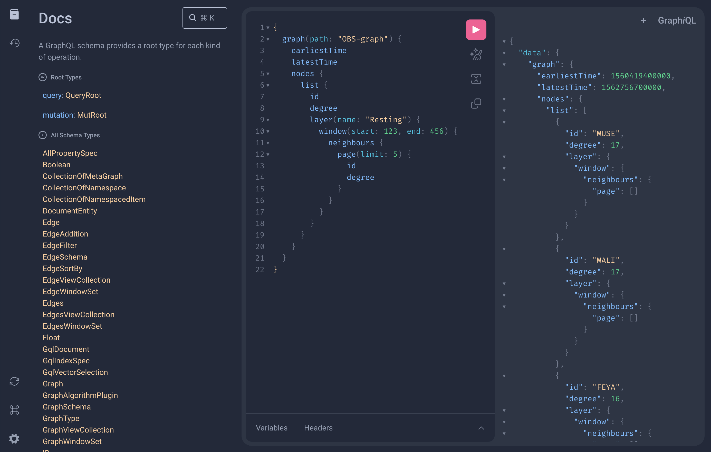

# Making GraphQL requests

The GraphQL API largely follows the same patterns as the Python API but has a few key differences.

In GraphQL, there are two different types of requests: a query to search through your data or a mutation of your data. Only the top-level fields in mutation operations are allowed to cause side effects. To accommodate this, in the Raphtory API you can make queries to graphs or metagraphs but must make changes using a mutable graph, node or edge.

This division means that the distinction between Graphs and GraphViews is less important in GraphQL and all non-mutable Graph endpoints are GraphViews while MutableGraphs are used for mutation operations. This is also true for Nodes and Edges and their respective views. Graphs can be further distinguished as either `PERSISTENT` or `EVENT` types.

## Graphical playground

When you start a GraphQL server, you can find your GraphQL UI in the browser at `localhost:1736/playground` or an alternative port if you specified one.

An annotated schema is available from the documentation tab in the left hand menu of the playground.



## Query a graph

Here are some example queries to get you started:

### List of all the nodes

/// tab |  GraphQL
```
query {
    graph(path: "your_graph") {
        nodes {
            list {
                name
            }
        }
    }
}
```
///

### List of all the edges, with specific node properties

To find nodes with `age`:

/// tab |  GraphQL
```
query {
    graph(path: "your_graph") {
        edges {
            list {
                src {
                    name
                    properties {
                        get(key:"age") {
                            value
                        }
                    }
                }
                dst {
                    name
                    properties {
                        get(key:"age") {
                            value
                        }
                    }
                }
            }
        }
    }
}
```
///

This will return something like:

!!! Output

    ```json
    {
    "data": {
        "graph": {
        "edges": {
            "list": [
            {
                "src": {
                "name": "Ben",
                "properties": {
                    "get": {
                    "value": 30
                    }
                }
                },
                "dst": {
                "name": "Hamza",
                "properties": {
                    "get": {
                    "value": 30
                    }
                }
                }
            },
            ]
        }
        }
    }
    }
    ```

All the queries that can be done in Python can also be done in GraphQL.

Here is an example:

/// tab |  GraphQL
``` graphql
query {
    graph(path: "your_graph") {
        node(name: "Ben") {
            properties {
                get(key: "age") {
                    value
                }
            }
        }
    }
}
```
///

/// tab | :fontawesome-brands-python: Python
```{.python notest}
g.node("Ben").properties.get("age")
```
///

### Examine the metadata of a node

Metadata does not change over the lifetime of an object. You can request it with a query like the following:


/// tab |  GraphQL
```
{
  graph(path: "traffic_graph") {
    nodes {
      list {
        name
        metadata {
          values {
            key
            value
          }
        }
      }
    }
  }
}
```
///

Which will return something like:

!!! Output
    ```json
    {
    "data": {
        "graph": {
        "nodes": {
            "list": [
            {
                "name": "ServerA",
                "metadata": {
                "values": [
                    {
                    "key": "datasource",
                    "value": "network_traffic_edges.csv"
                    },
                    {
                    "key": "server_name",
                    "value": "Alpha"
                    },
                    {
                    "key": "hardware_type",
                    "value": "Blade Server"
                    }
                ]
                }
            },
            {
                "name": "ServerB",
                "metadata": {
                "values": [
                    {
                    "key": "datasource",
                    "value": "network_traffic_edges.csv"
                    },
                    {
                    "key": "server_name",
                    "value": "Beta"
                    },
                    {
                    "key": "hardware_type",
                    "value": "Rack Server"
                    }
                ]
                }
            }
            ]
        }
        }
    }
    }
    ```

### Examine the properties of a node

Properties can change over time so it is often useful to make a query for a specific time or window.

/// tab |  GraphQL
```
{
  graph(path: "traffic_graph") {
    at(time: 1693555500000) {
      nodes {
        list {
          name
          properties {
            values {
              key
              value
            }
          }
        }
      }
    }
  }
}
```
///

Which will return something like:

!!! Output
    ```json
    {
    "data": {
        "graph": {
        "at": {
            "nodes": {
            "list": [
                {
                "name": "ServerA",
                "properties": {
                    "values": []
                }
                },
                {
                "name": "ServerB",
                "properties": {
                    "values": [
                    {
                        "key": "OS_version",
                        "value": "Red Hat 8.1"
                    },
                    {
                        "key": "primary_function",
                        "value": "Web Server"
                    },
                    {
                        "key": "uptime_days",
                        "value": 45
                    }
                    ]
                }
                },
                {
                "name": "ServerC",
                "properties": {
                    "values": []
                }
                }
            ]
            }
        }
        }
    }
    }
    ```

### Querying GraphQL in Python

You can also send GraphQL queries in Python directl using the [`.query()`][raphtory.graphql.RaphtoryClient.query] function on a `RaphtoryClient`. The following example shows you how to do this:

/// tab | :fontawesome-brands-python: Python
```{.python notest}
from raphtory import graphql
from raphtory.graphql import GraphServer

with GraphServer(work_dir).start():
    client = RaphtoryClient("http://localhost:1736")

    query = """{graph(path: "graph") { created lastOpened lastUpdated }}"""
    result = client.query(query)
```
///

Pass your graph object string into the `client.query()` method to execute the GraphQL query and retrieve the result in a python dictionary object.

!!! Output
    ```output
    {'graph': {'created': 1729075008085, 'lastOpened': 1729075036222, 'lastUpdated': 1729075008085}}
    ```

## Mutation requests

You can also mutate your graph. This can be done both in the GraphQL IDE and in Python.

From GraphQL these operations are available from the [Mutation root](../../../reference/graphql/graphql_API/#mutation-mutroot) which operates on mutable objects by specified by a path.

!!! note
    Some methods to mutate the graph are exclusive to Python.

### Sending a graph

You can send a graph to the server and overwrite an existing graph if needed.

/// tab | :fontawesome-brands-python: Python
```{.python notest}
from raphtory.graphql import GraphServer
tmp_work_dir = tempfile.mkdtemp()
with GraphServer(tmp_work_dir).start():
    client = RaphtoryClient("http://localhost:1736")

    g = Graph()
    g.add_edge(1, "bob", "emma")
    g.add_edge(2, "sally", "tony")
    client.send_graph(path="g", graph=g, overwrite=True)
```
///

To check your query:

/// tab | :fontawesome-brands-python: Python
```{.python notest}
query = """{graph(path: "g") {nodes {list {name}}}}"""
client.query(query)
```
///

This should return:

!!! Output

    ```json
    {
        "graph": {
            "nodes": {
                "list": [
                    {"name": "bob"},
                    {"name": "emma"},
                    {"name": "sally"},
                    {"name": "tony"},
                ]
            }
        }
    }
    ```

### Receiving graphs

You can retrieve graphs from a "path" on the server which returns a Python Raphtory graph object.

/// tab | :fontawesome-brands-python: Python
```{.python notest}
g = client.receive_graph("path/to/graph")
g.edge("sally", "tony")
```
///

### Creating a new graph

This is an example of how to create a new graph in the server.

The first parameter is the path of the graph to be created and the second parameter is the type of graph that should be created, this will either be _EVENT_ or _PERSISTENT_.
An explanation of the different types of graph can be found [here](../../user-guide/persistent-graph/1_intro.md)

/// tab |  GraphQL
```graphql
mutation {
    newGraph(path: "new_graph", graphType: PERSISTENT)
}
```
///

/// tab | :fontawesome-brands-python: Python
```{.python notest}
from raphtory.graphql import GraphServer

work_dir = tempfile.mkdtemp()
with GraphServer(work_dir).start():
    client = RaphtoryClient("http://localhost:1736")
    client.new_graph("path/to/new_graph", "EVENT")
```
///

The returning result to confirm that a new graph has been created:

!!! Output

    ```json
    {
    "data": {
        "newGraph": true
    }
    }
    ```

### Moving a graph

It is possible to move a graph to a new path on the server.

/// tab |  GraphQL
```graphql
mutation {
    moveGraph(path: "graph", newPath: "new_path")
}
```
///

/// tab | :fontawesome-brands-python: Python
```{.python notest}
from raphtory.graphql import GraphServer

work_dir = tempfile.mkdtemp()
with GraphServer(work_dir).start():
    client = RaphtoryClient("http://localhost:1736")
    client.move_graph("path/to/graph", "path/to/new_path)
```
///

The returning GraphQL result to confirm that the graph has been moved:

!!! Output

    ```json
    {
    "data": {
        "moveGraph": true
    }
    }
    ```

### Copying a graph

It is possible to copy a graph to a new path on the server.

/// tab |  GraphQL
```graphql
mutation {
    copyGraph(path: "graph", newPath: "new_path")
}
```
///

/// tab | :fontawesome-brands-python: Python
```{.python notest}
from raphtory.graphql import GraphServer

work_dir = tempfile.mkdtemp()
with GraphServer(work_dir).start():
    client = RaphtoryClient("http://localhost:1736")
    client.copy_graph("path/to/graph", "path/to/new_path)
```
///

The returning GraphQL result to confirm that the graph has been copied:

!!! Output

    ```json
    {
    "data": {
        "copyGraph": true
    }
    }
    ```

### Deleting a graph

It is possible to delete a graph on the server.

/// tab |  GraphQL
```graphql
mutation {
    deleteGraph(path: "graph")
}
```
///

/// tab | :fontawesome-brands-python: Python
```{.python notest}
from raphtory.graphql import GraphServer

work_dir = tempfile.mkdtemp()
with GraphServer(work_dir).start():
    client = RaphtoryClient("http://localhost:1736")
    client.delete_graph("graph")
```
///

The returning GraphQL result to confirm that the graph has been deleted:

!!! Output

    ```json
    {
    "data": {
        "deleteGraph": true
    }
    }
    ```

### Updating the graph

It is possible to update the graph using the `remote_graph()` method.

/// tab | :fontawesome-brands-python: Python
```{.python notest}
from raphtory.graphql import GraphServer

work_dir = tempfile.mkdtemp()
    with GraphServer(work_dir).start():
        client = RaphtoryClient("http://localhost:1736")
        client.new_graph("path/to/event_graph", "EVENT")
        rg = client.remote_graph("path/to/event_graph")
        rg.add_edge(1, "sally", "tony", layer="friendship")
```
///

Once you have updated the graph, for example by adding an edge, you can receive a graph by using `receive_graph()` and specifying the path of the graph you would like to receive.

/// tab | :fontawesome-brands-python: Python
```{.python notest}
g = client.receive_graph("path/to/event_graph")
```
///
