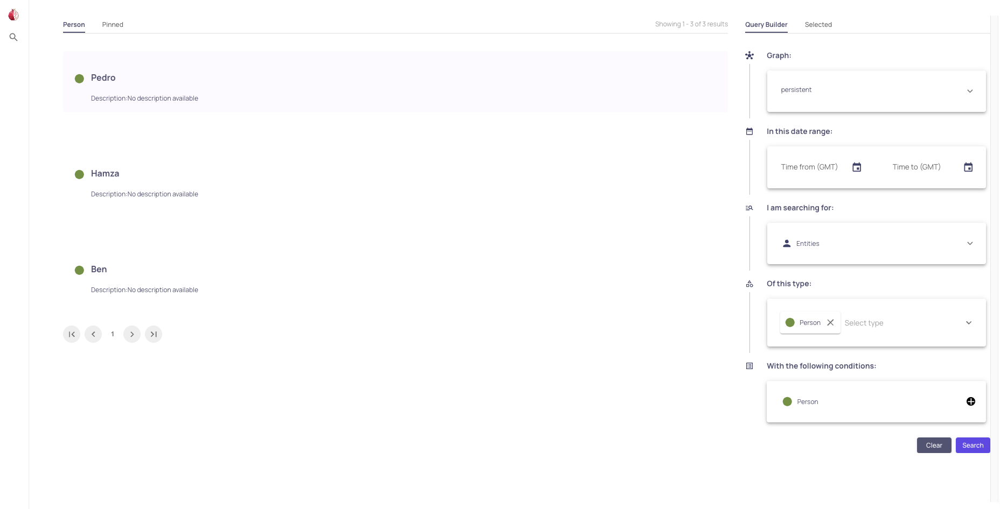
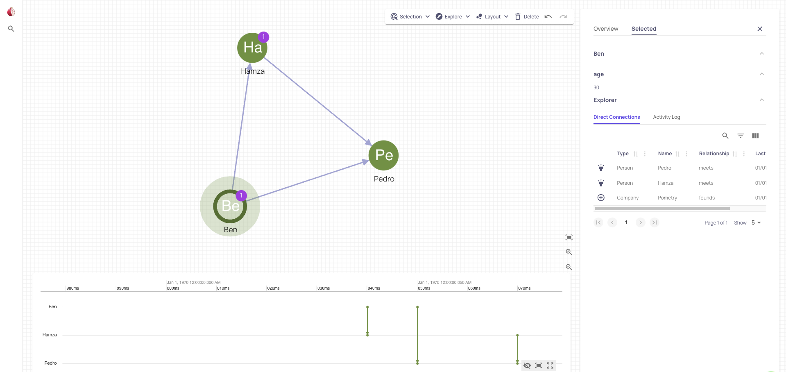

# Running the UI

Raphtory allows you to easily set up a sophisticated UI to examine and analyze your data.

To run the UI, you will first need to have the [GraphQL server](../../user-guide/graphql/2_run-server.md) running. Once the server is running, the UI will be available on the same port.

## Search page

The search page of the UI is used to search and filter your data. For example, you can narrow your search by date, graph name and even node properties. You can view a node's direct connections as well as its activity log and history. By double clicking on one of the results, you can navigate to the graph page where you will see a graphical representation of your data.

## Graph page

The graph page of the UI is used to explore your data and graph in an interactive way. Here you will be able to see all your nodes and edges in a clear format, with the ability to delete, expand and so much more.

