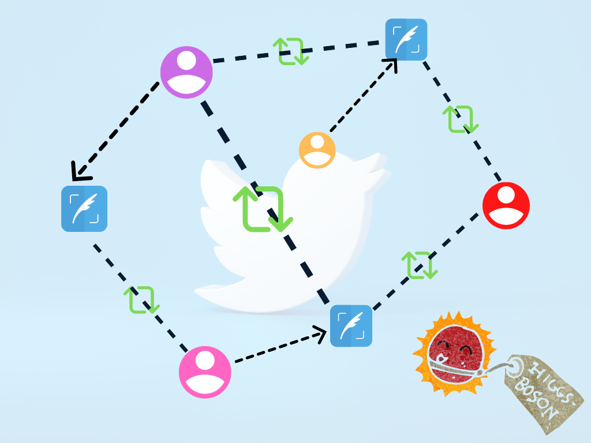

# Detecting bot activity on Twitter

## Overview

Raphtory implements a chain of algorithms to analyse a Twitter dataset from [SNAP](https://snap.stanford.edu/data/higgs-twitter.html), collected during and after the announcement of the discovery of a new particle with the features of the elusive Higgs boson on 4th July 2012. In our example, we have taken the retweet network data. We wanted to see whether Raphtory could detect bot retweet activity in the Higgs dataset.

<p>
 
</p>

We used three algorithms in this example: PageRank, MemberRank and TemporalMemberRank.

[PageRank](https://en.wikipedia.org/wiki/PageRank) is an algorithm used to rank web pages during a Google search. PageRank algorithm ranks nodes depending on their connections to determine how important the node is. This assumes a node is more important if it receives more connections from others. Each vertex begins with an initial state. If it has any neighbours, it sends them a message which is the initial label / the number of neighbours. Each vertex, checks its messages and computes a new label based on: the total value of messages received and the damping factor. This new value is propagated to all outgoing neighbours. A vertex will stop propagating messages if its value becomes stagnant (i.e. has a change of less than 0.00001). This process is repeated for a number of iterate step times. Most algorithms should converge after approx. 20 iterations.

MemberRank is an algorithm that takes the PageRank score from the vertex neighbours and the original ranking of the vertex from the raw dataset and multiplies the two scores together to form the 'MemberRank score'. A vertex receiving a high MemberRank score means that other people with high PageRank scores have ranked them highly. If the Twitter user is influential, MemberRank will bump their score higher. If the Twitter user is non-influential (potentially a bot) the MemberRank score will be low. This should dampen the effect of bots further.

TemporalMemberRank is an algorithm that filters users with big differences in their raw dataset scores and MemberRank scores (potential bots) and checks their in-edge creations over time. Bot activity usually occurs in a very short timeframe (spamming) or at regular intervals. This algorithm will be able to give more evidence on whether a particular user is a bot or not. 

## Project Overview

This example builds a temporal graph from the [Higgs Twitter Dataset](https://snap.stanford.edu/data/higgs-twitter.html) and runs a query to tell us potential bot retweet activity.

The data is a `csv` file (comma-separated values) and is located in the Raphtory Data folder. Each line contains user A and user B, where user B is being retweeted by user A. The last value in the line is the time of the retweet in Unix epoch time.

Also, in the examples folder you will find `TwitterGraphBuilder.scala` and `HiggsRunner.scala`.

* `TwitterGraphBuilder.scala` builds the graph
* `HiggsRunner.scala` runs the application including the analysis

There are three algorithm files to run the analysis: `PageRank.scala`, `MemberRank.scala` and `TemporalMemberRank.scala`.
* `PageRank.scala`  based on the Google Pagerank algorithm, ranks nodes (Twitter Users) depending on their connections to determine how important the node is. 
* `MemberRank.scala` takes the Page Rank score and ranks users further by taking into account the number of retweets they received.
* `TemporalMemberRank.scala` filters nodes with big differences in the number of retweets they received on Twitter and the final rank given to them by MemberRank, outputting the suspected retweet bot IDs, along with the user ID they retweeted and the time of the retweet. The first element in each line is the Pulsar Output Timestamp, this can be dropped or ignored as it is irrelevant to the bot activity results.

In `HiggsRunner.scala` we have chained the three algorithms together, but you are able to alter the algorithms you would like to run to get your desired results. e.g. `PageRank() -> MemberRank()`

We have also included Python scripts in directory`src/main/python` to output the dataframes straight into Jupyter notebook.


## Installation Guide

Scala Installation Guide: https://docs.raphtory.com/en/development/Install/scala/install.html,

Python Installation Guide: [With Conda](https://docs.raphtory.com/en/development/Install/python/install_conda.html) and [Without Conda](https://docs.raphtory.com/en/development/Install/python/install_no_conda.html)

## Output

When you start `HiggsRunner.scala` you should see logs in your terminal like this:
```json
15:01:51.382 [io-compute-1] INFO  com.raphtory.api.querytracker.QueryProgressTracker - Job 567016506_547334920456690000: Starting query progress tracker.
15:01:51.385 [spawner-akka.actor.default-dispatcher-8] INFO  com.raphtory.internals.components.querymanager.QueryManager - Query '567016506_547334920456690000' currently blocked, waiting for ingestion to complete.
15:04:38.239 [spawner-akka.actor.default-dispatcher-8] INFO  com.raphtory.internals.components.querymanager.QueryManager - Source '0' is unblocking analysis for Graph 'prime_moccasin_mouse' with 1064790 messages sent.
15:04:38.369 [spawner-akka.actor.default-dispatcher-8] INFO  com.raphtory.internals.components.querymanager.QueryManager - Query '567016506_547334920456690000' received, your job ID is '567016506_547334920456690000'.
15:04:38.379 [spawner-akka.actor.default-dispatcher-6] INFO  com.raphtory.internals.components.partition.QueryExecutor - 567016506_547334920456690000_0: Starting QueryExecutor.
15:04:52.122 [spawner-akka.actor.default-dispatcher-3] INFO  com.raphtory.internals.components.querymanager.QueryHandler - Job '567016506_547334920456690000': Perspective at Time '1341705593' took 13723 ms to run.
15:04:52.122 [spawner-akka.actor.default-dispatcher-11] INFO  com.raphtory.api.querytracker.QueryProgressTracker - Job '567016506_547334920456690000': Perspective '1341705593' finished in 180740 ms.
15:04:52.122 [spawner-akka.actor.default-dispatcher-11] INFO  com.raphtory.api.querytracker.QueryProgressTracker - Job 567016506_547334920456690000: Running query, processed 1 perspectives.
15:04:52.124 [spawner-akka.actor.default-dispatcher-3] INFO  com.raphtory.api.querytracker.QueryProgressTracker - Job 567016506_547334920456690000: Query completed with 1 perspectives and finished in 180742 ms.
```
This indicates that the job has finished and your data should be ready to be analysed in Jupyter Notebook.
```json
15:04:52.122 [spawner-akka.actor.default-dispatcher-11] INFO  com.raphtory.api.querytracker.QueryProgressTracker - Job '567016506_547334920456690000': Perspective '1341705593' finished in 180740 ms.
15:04:52.122 [spawner-akka.actor.default-dispatcher-11] INFO  com.raphtory.api.querytracker.QueryProgressTracker - Job 567016506_547334920456690000: Running query, processed 1 perspectives.
15:04:52.124 [spawner-akka.actor.default-dispatcher-3] INFO  com.raphtory.api.querytracker.QueryProgressTracker - Job 567016506_547334920456690000: Query completed with 1 perspectives and finished in 180742 ms.
```

Output for Vertex 4 (potential bot): 

```json
sys_time       src      dst	       time
1341705593	4	117251	2012-07-04 05:20:05
1341705593	4	9631	2012-07-04 05:26:56
1341705593	4	270457	2012-07-04 05:28:27
1341705593	4	21541	2012-07-04 05:28:59
1341705593	4	357839	2012-07-04 05:29:13
1341705593	4	497	2012-07-04 05:29:26
1341705593	4	6765	2012-07-04 05:30:01
1341705593	4	180606	2012-07-04 05:30:04
1341705593	4	73922	2012-07-04 05:30:35
1341705593	4	92987	2012-07-04 05:32:06
1341705593	4	244918	2012-07-04 05:32:50
1341705593	4	85583	2012-07-04 05:34:41
1341705593	4	117251	2012-07-04 05:40:06
1341705593	4	114744	2012-07-04 05:41:36
1341705593	4	281202	2012-07-04 05:42:05
1341705593	4	52232	2012-07-04 05:50:21
1341705593	4	85084	2012-07-04 05:50:40
1341705593	4	5552	2012-07-04 05:51:10
1341705593	4	6765	2012-07-04 05:51:43
1341705593	4	497	2012-07-04 05:52:11
1341705593	4	156739	2012-07-04 05:52:12
1341705593	4	18205	2012-07-04 05:52:27
1341705593	4	39065	2012-07-04 05:52:55
1341705593	4	89050	2012-07-04 05:53:06
1341705593	4	2564	2012-07-04 05:54:02
1341705593	4	315004	2012-07-04 05:54:29
1341705593	4	63669	2012-07-04 05:54:34
1341705593	4	127424	2012-07-04 05:56:57
1341705593	4	9662	2012-07-04 06:00:08
1341705593	4	62056	2012-07-04 06:02:06
1341705593	4	424319	2012-07-04 06:03:03
1341705593	4	103978	2012-07-04 06:03:54
1341705593	4	103978	2012-07-04 06:03:58
1341705593	4	34620	2012-07-04 06:04:47
1341705593	4	424047	2012-07-04 06:09:55
1341705593	4	1162	2012-07-04 06:13:05
1341705593	4	264150	2012-07-04 06:15:09
1341705593	4	134193	2012-07-04 06:15:33
1341705593	4	55836	2012-07-04 06:16:36
```
We singled out vertex 4 as an example user that may show bot activity since after the final step of the chaining: `TemporalMemberRank.scala`, the score that vertex 4 originally had in the raw dataset significantly decreased after running PageRank and MemberRank. The output shows retweet activity happening within minutes and seconds of each other, this could be an indication of suspicious activity and further analysis on this data can be performed.

Feel free to play around with the example code and Jupyter notebook analysis. For example, in `TemporalMemberRank.scala`, you can change line 32:
`val difference: Boolean = (positiveRaw > (positiveNew * 4))`
`4` is the multiplication factor to see if the raw scores and new scores are significantly different. This can be increased or decreased depending on your desired analysis. 
